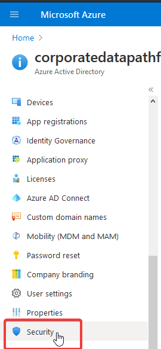
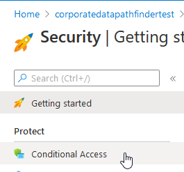
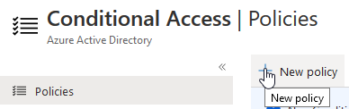
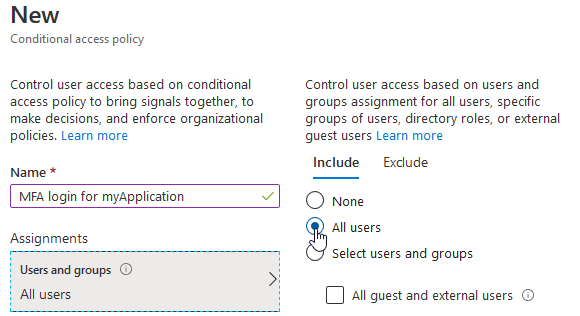
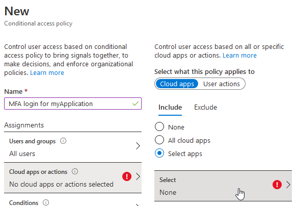
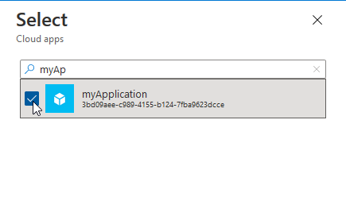
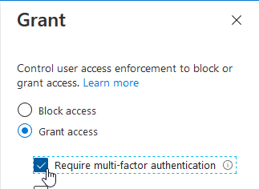
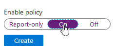

# Configuring MFA for your Azure app

1. Nagivate to [http://portal.azure.com](https://portal.azure.com/#blade/Microsoft_AAD_IAM/ActiveDirectoryMenuBlade/Overview) and go to the Active Directory

2. Go to the "Security" tab on the left nav

2. Go to the "Conditional Access" tab that appeared on the left nav

3. Click "New Policy"

4. Set the "Users and groups" assignment to affect "All users"

5. Set the "Cloud apps or actions" to affect your specific apps

You can select multiple apps for the policy to affect.

6. Under "Access controls", go to the "Grant" section to activate MFA requirements

7. Enable the policy, then click "Create"

