# On premise single-sign-on using Azure as an Identity Provider

## Prelude

Ensure you have a /etc/hosts entry for `idptestbed` point to your docker host.

## Creating the Azure AD asset

1. Go to [portal.azure.com](https://portal.azure.com/#allservices) and go to Active Directory

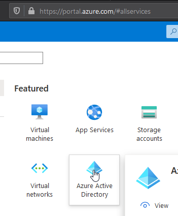

2. On the left nav, go to Enterprise Applications

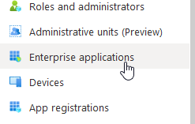

3. Click "New application"

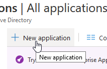


4. Pick "Non-gallery application"

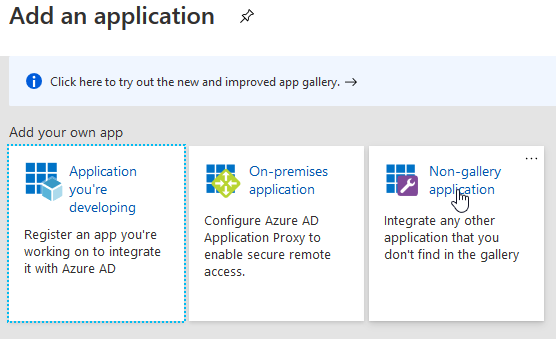

5. Pick a name and click "Add" on the bottom left of the page


6. Go to users and groups

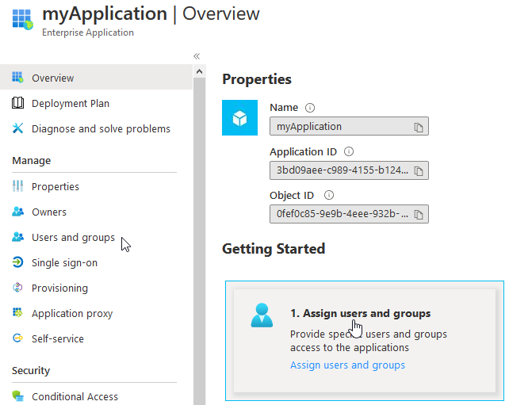

7. Click on "Add user"

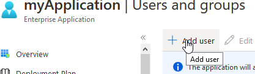

8. Click on "Users and groups", and select your account, then hit "Assign" in the bottom left

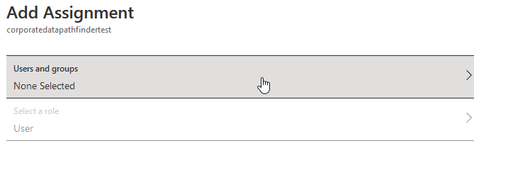

## Configuring SP

1. Go to the "Single sign-on" page for your enterprise application

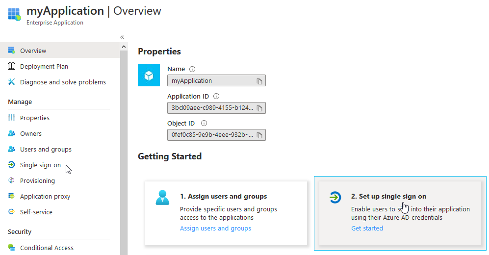


2. Pick "SAML"

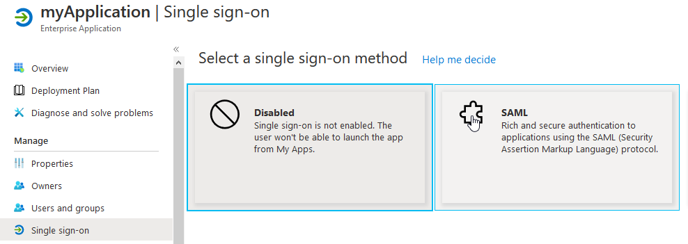

3. Download the azure metadata

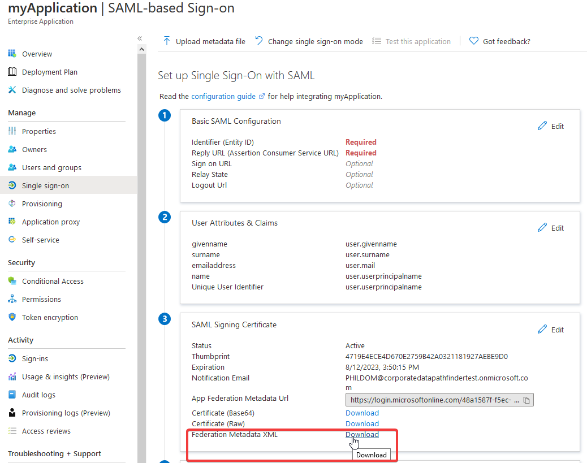

4. Replace the contents of [sp/etc-shibboleth/idp-metadata.xml](../sp/etc-shibboleth-idp.metadata.xml) with the downloaded metadata

5. Add the scope declaration to the idp metadata

Add the schema definition as an attribute of the `EntityDescriptor` tag

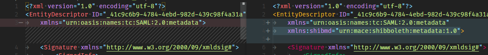

```xml
xmlns:shibmd="urn:mace:shibboleth:metadata:1.0"
```

Add the scope extension under the `IDPSSODescriptor` tag to match your onmicrosoft name. This example uses `034gc`

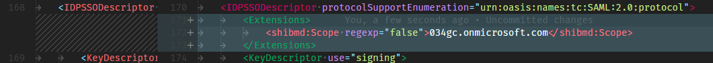

```xml
		<Extensions>
			<shibmd:Scope regexp="false">034gc.onmicrosoft.com</shibmd:Scope>
		</Extensions>
```

6. Replace the entity id in shibboleth2.xml with the one from the top of the azure metadata

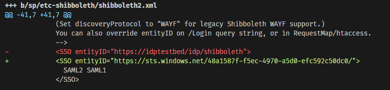

## Configuring Azure

1. Go to the claims edit page

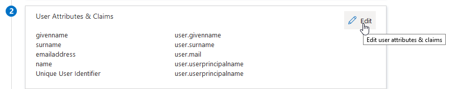

2. Add a new claim

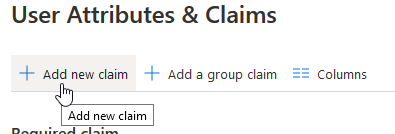

3. Configure the attributes of the claim

Name: `sAMAccountName`

Namespace: `http://schemas.xmlsoap.org/ws/2005/05/identity/claims`

Source attribute: `user.userprincipalname`

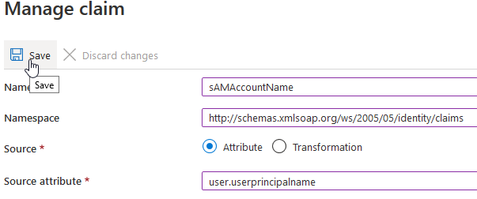

4. Start the SP and download the metadata from [http://idptestbed/Shibboleth.sso/Metadata](http://idptestbed/Shibboleth.sso/Metadata)

The SP can be started by running `docker-compose up --build`

5. Upload the downloaded metadata to azure

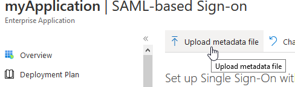

6. Save the default upload configuration

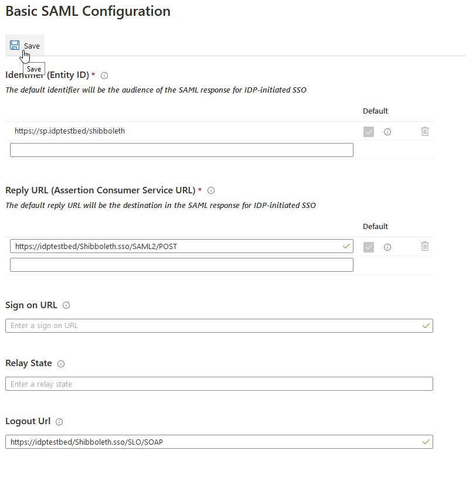

## Test the setup

1. Under the SAML Single Sign On settings for the enterprise application, scroll down and click "Test"

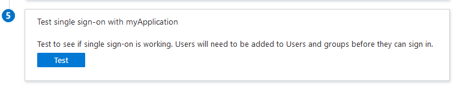

2. Test signing on as current user

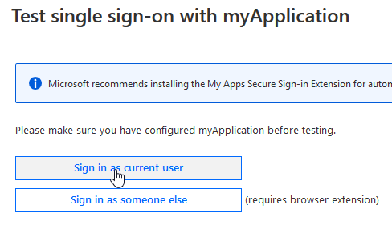

3. It should navigate you to the landing page

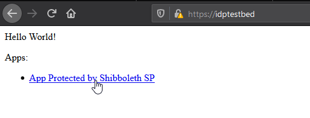

4. Click the link to be brought to the phpinfo page

5. Ensure that the REMOTE_USER variable is being set

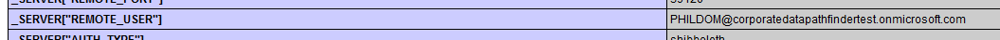

If it's not set, double check the shibmd:scope in the idp-metadata.xml file

## Conclusion

<span style="font-size:32px;text-decoration:underline;">Congratulations!</span>

You now have a working Service Provider that uses Azure for logins.

You can now use azure for your users, including being able to force MFA for your service.